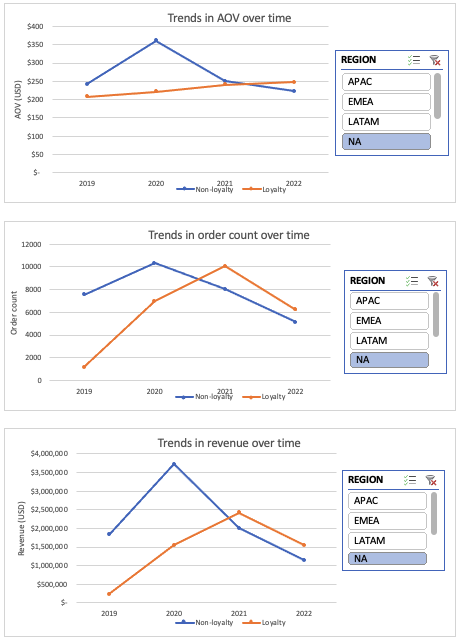

# Boosting Sales and Efficiency for E-Commerce: Data-Driven Insights and Recommendations
Established in 2018, Unboxed is a US-based e-commerce company that sells popular consumer electronics and accessories to a global clientele. As the company has grown and expanded in the last few years, it has encountered increasingly fierce competition as well as unique challenges and opportunities brought on by the COVID-19 pandemic. 

Unboxed has data on more than 100,000 customer transactions across several dimensions and metrics, including sales, products, marketing efforts, operations, and its loyalty program. To help the company's Head of Operations understand the company's performance over the last several years (2019 - 2022), a thorough and comprehensive analysis was conducted on the company's data. The analysis uncovered insights that can be leveraged by different teams across the company to improve processes and boost Unboxed's commercial performance. The insights and recommendations center on the following key areas:

* **Sales trends** - Focusing on key metrics of sales revenue, number of orders placed, and average order value (AOV).
* **Loyalty program evaluation** - Evaluating the effectiveness of the company's loyalty program and providing recommendations to maximize customer engagement and retention.
* **Product performance** - Analyzing different product lines, market impact, and refund rates to inform strategic product decisions.
* **Operational effectiveness** - Evaluating logistics and operational efficiency to identify areas for improvement.
* **Marketing channel performance** - Analyzing campaign performance across channels to identify most effective ones to increase brand awareness and acquire new customers.

---
## Data Structure, Processing, and Cleaning

The dataset contains a total of 108,127 records stored in 4 tables, as shown below. 

   
  Entity relationship diagram (ERD) of Unboxed's data.

A series of data processing and cleaning steps were first undertaken to understand and address data quality issues, including missing and nonsensical values in several columns, as well as inconsistent formatting. These steps were carried out in Excel and are documented [here]().

---
## Summary of Insights

### Sales trends

#### Growth rates
* _Overall performance_: From 2019 to 2022, over **108K orders were placed for a total revenue of $28M, with an average order value (AOV) of $260**. North America, which drives over half of Unboxed's total revenue, is its biggest market, followed by Europe, the Middle East, and Africa (30%), the Asia-Pacific region (12%), and Latin America (6%).

* _Pandemic-driven growth_: As seen above, the company saw explosive growth in 2020 across all markets, likely related to increased spending during the COVID-19 pandemic: **AOV rose by 31% and order count doubled, driving the highest yearly revenue on record** ($10M, a 163% increase from the previous year). A closer look at the month-over-month growth rates in 2020 reveals that order count and revenue both rose by approximately 50% in March, the highest growth rate on record. This timing coincides with the start of pandemic-related lockdowns, suggesting that consumers with an increased appetite for consumer electronics amidst lockdown restrictions might have driven the company's impressive growth in 2020.

* _Post-pandemic sales slump_: While the company was able to maintain its pandemic sales boost into 2021, 2022 saw a slump in sales across all markets. Revenue fell by 46% from the previous year, driven by a significant decrease in number of sales (down 40% from the previous year).

     
    View of Unboxed's key sales metrics, broken down by year and region (for revenue).

     
    A snapshot of month-over-month growth rates shows an increase in order count and revenue in March 2020.

#### Seasonality
* Unboxed's sales trends exhibit seasonality, with a consistent upward tick in sales in August, September, November, and December. These months coincide with the start of the school year and holidays like Christmas, suggesting these shopping-heavy months may be a potential reason for this seasonality trend.

### Loyalty program
* _Non-loyalty customers drove sales in early years_: In 2019 and 2020, loyalty customers placed fewer orders than non-loyalty customers, and their orders were less expensive than those of non-loyalty customers. In these first two years of the loyalty program, non-loyalty customers drove the bulk of the total revenue.

* _Reversal in trends_: However, **in 2021 and 2022, not only did loyalty customers place more orders than non-loyalty customers, but they also spent on average $30 more per order than non-loyalty customers.** In 2022, purchases made by loyalty customers accounted for 55% of the yearly total revenue and 52% of the total orders placed.

* _Performance across regions_: The loyalty program performed especially well in North America, the only region where loyalty customers surpassed non-loyalty customers in all key metrics (AOV, order count, and revenue) in 2022.

     
    Increase in loyalty program effectiveness in recent years.

     
    Loyalty customers surpassed non-loyalty customers across all key sales metrics in North America in 2022.

**Note:** SQL was used to conduct the analyses for the following insights. The SQL queries are documented in [this script](https://github.com/ruiruigao/unboxed_ecommerce/blob/main/stakeholder_townhall_questions.sql).

### Product performance

* _Overall product performance_: Overall, 4 out of the company's 8 product offerings (27in 4K Gaming Monitor, Apple Airpods Headphones, Macbook Air Laptop, ThinkPad Laptop) accounted for **96% of the total revenue** earned across all years. The Apple Airpods Headphones are the company's best-selling product, accounting for **45% of all sales for a total revenue of $7.7M**. Revenue-wise, the 27in 4K Gaming Monitor is the most profitable product, accounting for **$9.9M in total revenue**. 

* _Positive relationship between AOV and refund rate_: Higher-ticket items (Macbook Air Laptop, ThinkPad Laptop, Apple iPhone) also had the highest refund rates (ranging from 7.6% - 11.7%), potentially because customers may be more likely to seek out a refund when they are unsatisfied with an expensive product.

* _Brand dominance_: Apple was the best-selling brand in every region, driving 40% - 51% of the company's sales in each region (highest: EMEA at 51%; lowest: LATAM at 40%). 

### Operational efficiency

* _Overall efficiency across regions_: In general, Unboxed's delivery times lag behind the average delivery speed of 2-4 days offered by its competitors. Orders from customers in EMEA and APAC took an average of 7.6 days to be delivered, compared to 7.5 days and 7.4 days for NA and LATAM customers, respectively. The discrepancy between delivery times across regions appears to be mainly due to differences in order shipping times -- orders from EMEA and APAC had longer delays before shipment, compared to orders from NA and LATAM. 

* On average, delivery times were the same for non-loyalty program customers and loyalty program customers. There may be an opportunity to incentivize loyalty program signup by reducing the delivery times for loyalty program customers.

* Quarter-to-quarter, there were more frequent fluctuations in average shipping times (ranging from 1.7 to 3.2 days), while transit time remained generally consistent (ranging from 5.4 to 5.6 days). Because time in transit accounts for the bulk of the overall delivery time, meaningful reductions in transit time would greatly improve operational efficiency.

### Marketing channel performance

* _Overall performance across regions_: The top two most effective marketing channels for each region were 1) direct marketing and 2) email campaigns, both by number of purchases as well as revenue generated. In North America, the company's biggest market, direct marketing drove **over 31K orders for a total of $8.8M in revenue**. Email marketing was a far second, driving **$1.4M in revenue**. Social media was the least effective channel in all regions, driving **only $150K** in the company's largest market. 

* For orders placed on mobile, social media and affiliate marketing were most effective at driving more expensive purchases, with an AOV of $87 and $71, respectively. For orders placed on the website, the most effective channels for driving more expensive purchases were affiliate and direct marketing at AOVs of $329 and $307, respectively.

* The biggest share of loyalty program customers came through the direct marketing channel (ADD PERCENT). However, email marketing had the highest average loyalty program signup rate across all years, with almost 50% of email-marketed customers enrolling in the loyalty program. 

---
## Recommendations

The following recommendations are based on the insights above and relate to different teams: 

* **Marketing team:** We recommend continuing with the loyalty program, since this segment of customers has been placing more orders, as well as more expensive orders, than non-loyalty customers in recent years. We also recommend investigating reasons for why email marketing is particularly effective at driving loyalty program signup and using these findings to further optimize future email marketing campaigns to encourage continued signups. Based on our findings, direct marketing is by far the most effective method at driving number of sales and total revenue, and therefore should be allocated the most budget and resources. 

* **Operations team:** We recommend investigating ways to increase shipping times for EMEA and APAC customer orders, as well as considering how to reduce overall delivery time to boost customer retention, especially if competitors are offering shorter delivery times. There may also be an opportunity for crossfunctional collaboration between the marketing and operations teams to engage and retain loyalty program customers by offering shorter delivery times to this segment of customers. 

* **Product/inventory management:** We would recommend further in-depth analysis to understand why the 4 top-performing products are successful and consider expanding offerings based on these anchor products, such as accessories that can be paired with these products to enhance their performance or useability. Given the company's reliance on these 4 core products, inventory levels should be optimized for these products to reduce stockouts and maximize sales opportunities. 

---
## Showcase

The image below showcases some visualizations from the Tableau dashboard. 

Click here to view the full dashboard.
